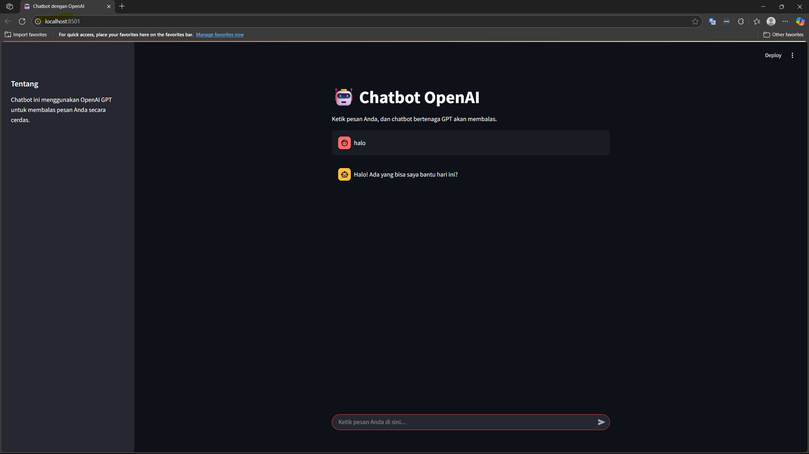

# 🤖 Chatbot AI Sederhana


Proyek chatbot berbasis GPT-3.5 ini dirancang untuk membantu bisnis kecil menangani pertanyaan rutin pelanggan, menghemat waktu, dan meningkatkan pelayanan.

## 🚀 Cara Install & Jalankan

1. Clone repository ini:

```bash
git clone https://github.com/VoidK41/chatbot_project
cd chatbot_project
```

2. Install dependensi:

```bash
pip install -r requirements.txt
```

3. Jalankan aplikasi:

```bash
streamlit run chatbot_gpt.py
```

## ✨ Fitur Utama
- Respon otomatis berbasis AI (GPT-3.5)
- Antarmuka web sederhana dengan Streamlit
- Bisa di-custom untuk kebutuhan bisnis

## 📸 Screenshot



## 📊 Contoh Output

```
User: halo
Bot: Halo! Ada yang bisa saya bantu hari ini?
```

## 👨‍💻 Author

**Khairu Ikramendra**  
Freelance dashboard developer & data analyst  
[LinkedIn](https://www.linkedin.com/in/khairuikramendra/) | [Upwork](https://www.upwork.com/freelancers/~017002e8546494c6e9)
